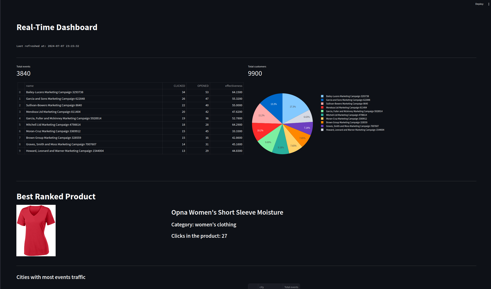
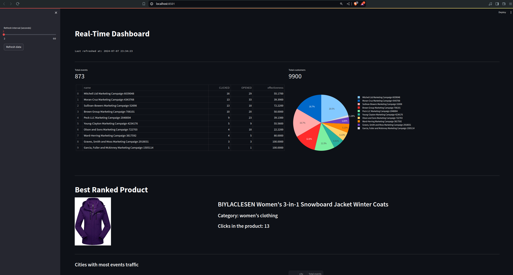
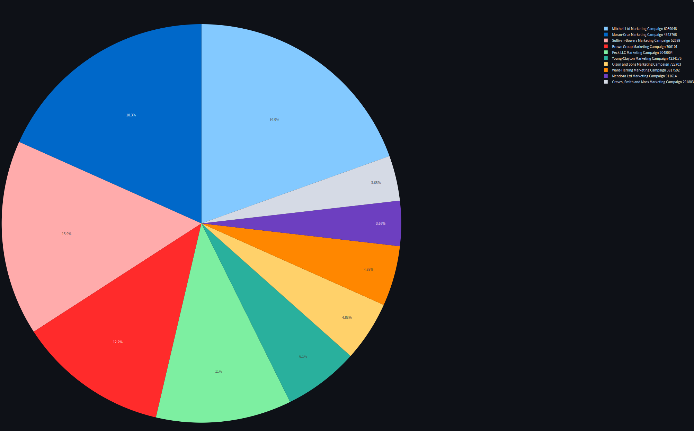

Here's the updated README file including the additional metrics information:

---

# Real-Time Data Processing and Dashboarding Project

## Overview

This project is designed to handle real-time data processing and provide insights through an interactive dashboard. The data pipeline involves the following steps:

1. **Data Collection**: Collecting event data (such as open, click, delivered) from users.
2. **Data Processing**: Using Kafka for streaming data collection and PySpark for real-time data transformation.
3. **Data Storage and Enrichment**: Storing enriched data in a PostgreSQL database and organizing cleaned data in various Kafka topics based on business rules.
4. **Data Visualization**: Utilizing Python and Pandas to create a Streamlit dashboard for real-time insights and visualizations.

## Architecture

The data pipeline is structured in three layers:

1. **Bronze Layer (Data Collection)**:
    - Users generate events (open, click, delivered).
    - Events are collected in a Kafka cluster and stored in a raw events topic.

2. **Silver Layer (Data Cleaning, Preprocessing, and Modeling)**:
    - PySpark processes and transforms the streaming data.
    - Enriched data is stored in a PostgreSQL database.
    - Additional Kafka topics store cleaned data ready for analysis (e.g., campaign effectiveness, events aggregation, city events aggregation).

3. **Gold Layer (Data Visualization and Analysis)**:
    - A Python/Pandas service processes the data.
    - Streamlit is used to create a real-time dashboard displaying insights and visualizations.

## Key Metrics

The project also calculates and displays key marketing metrics, including:

- **Click-Through Rate (CTR)**: Measures the ratio of users who click on a specific link to the number of total users who view the page, email, or advertisement.
- **Campaign Effectiveness**: Evaluates how well a marketing campaign performs in terms of achieving its goals.
- **Product Popularity**: Tracks how well a specific product is performing in terms of user engagement and interest.
- **Behavior Analysis**: Analyzes how users interact with the campaign over time.

## Project Structure

```
.
├── bin/
│   ├── aggregation/
│   │   ├── realtime_aggregations.py
│   │   ├── __init__.py
│   │   └── checkpoints/
│   ├── app/
│   │   ├── __init__.py    
│   │   ├── dashboard.py
│   │   └── statefull/
│   │       ├── __init__.py
│   │       └── dashboard_data_db.py      
│   │          
│   ├── settings/
│   │   │
│   │   ├── db_settings/
│   │   │   ├── tables_settings.py
│   │   │   └── __init__.py
│   │   │    
│   │   ├── events_stream.py
│   │   ├── main_settings.py
│   └───└── mock_data_settings.py
│
├── docs/
│   ├── images/
│   └── video/
│
├── .gitignore
├── docker-comose.yml
├── Dockerfile
├── requirements.txt
└── README.md
```

## Setup and Installation

1. **Clone the repository**:
    ```bash
    https://github.com/santiagoLagosBk/marketing_analytics.git
    cd realtime-data-dashboard
    ```

2. **Install dependencies**:
    ```bash
    pip install -r requirements.txt
    ```

3. **Configure Kafka**:
    - Ensure Kafka is installed and running.
    - Update the .env file detailing the environment variables.

4. **Run the Kafka Consumer**:
    ```bash
    docker compose up
    ```

5. **Run the PySpark Job**:
    ```bash
    python3 bin/settings/main_settings.py
    python3 bin/settings/events_stream.py
    python3 bin/aggregation/realtime_aggregations.py
    ```

6. **Run the Streamlit App**:
    ```bash
    streamlit bin/app/dashboard.py
    ```

## Usage

- **Data Collection**: Events are automatically collected from users and sent to the Kafka cluster.
- **Data Processing**: The PySpark job processes the data in real-time.
- **Data Visualization**: Access the Streamlit dashboard to view real-time insights and analytics.

## Evidence of Application Running

### Video Demonstrations

- **Data Collection and Kafka Integration**:
  _Insert video link or image here_

- **PySpark Data Processing**:
  _Insert video link or image here_

- **Streamlit Dashboard**:
  _Insert video link or image here_

### Screenshots

- **Streamlit Dashboard**:
  
- --
  
- --
  


## Realtime dashboard
- **Streamlit Dashboard**:
  [](./docs/video/Screencast from 07-07-2024 11:28:55 PM.webm)
- --
   [](./docs/video/Screencast from 07-07-2024 11:30:10 PM.webm)


## Contributing

Contributions are welcome! Please create an issue or submit a pull request for any improvements or suggestions.

## License

This project is licensed under the MIT License - see the [LICENSE](LICENSE) file for details.